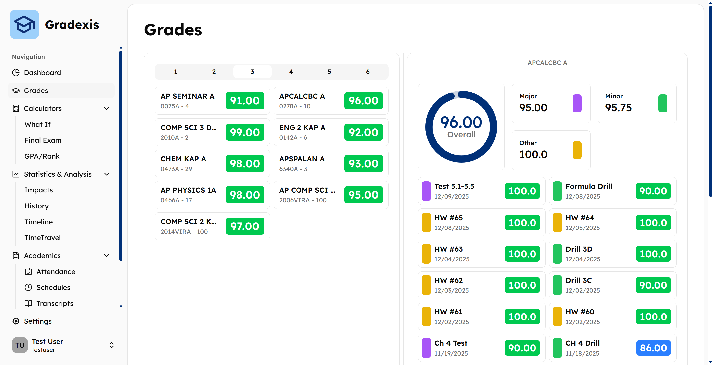
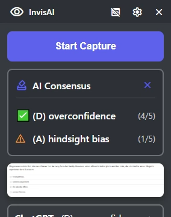

## Hi! I'm `@ruskcoder`

I am a high school sophomore who loves to code and do robotics!

Right now, I am working on **Gradexis**, a mobile app for grades. Check it out at: 
http://gradexis.com/

I also built InvisAI, a python based application that uses Gpt4free and selenium for free AI APIs, and is invisible to screen capture software. It uses 5 different AIs to check answers. 

